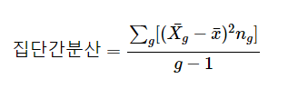
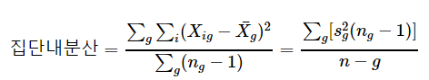
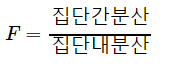

# 기본적 아이디어

집단의 분산을 기준으로 두 개 이상 집단을 비교

집단 간 분산이 크면 평균이 멀리 떨어져 있다는 의미. 즉, 분산이 크다는 말과 평균이 다르다는 말은 같은 맥락.


그러나 분산이 큰 경우에는 평균이 다르지만 공유하는 부분이 많아 집단이 다르다고 주장하기 어려움. 평균과 분산을 함께 봐야 진정 평균이 다르다는 의미를 알 수 있음.


집단 내 분산이 작은 경우, 평균의 사소한 차이가 집단이 다르다는 점을 보여줄 수도 있음.


집단 내 분산이 작으면서 집단 간 분산이 작은 경우. 여전히 겹치는 영역이 존재하게 되어 집단이 다르다고 주장하기 어려움 


## F-분포

집단 간 분산과 집단 내 분산의 비(ratio)

집단은 모두 같은 모집단에서 나왔다는 가정을 검정하려는 것임

만약 모집단이 다르면 F-값이 커지는 특성이 있음

F값은 분산의 비율로 이해됨

F값을 계산하기 위해 필요한 자유도는: 집단 간 분산(between group) 자유도와 집단 내(within group) 분산의 자유도




### 집단 내 분산의 의미

집단 내 분산이란 집단 내 관측값이 그 집단의 평균값으로부터 떨어져 있는 정도를 나타냄. 

모집단의 등분산성이 가정되면 각 집단의 분산을 평균하여 하나의 집단(모집단)의 분산을 계산할 수 있음.

이 계산값과 각 집단의 비교가 핵심 아이디어.



집단의 표준편차를 집단 내 자유도를 가중치로 하여 그 효과를 더한 것에 집단의 크기를 고려한 효과를 할인하여 개별 집단의 효과로 계산한 것임.

### F값의 의미

집단 간 분산을 집단 내 분산으로 할인한 것. 집단 간 분산이 크고(서로 떨어져 있음), 집단 내 분산이 작으면(자기끼리 더 모임) F-값이 커지고, 이는 각 집단이 사실 같은 모집단이 아닐 것이라는 생각을 뒷받침함




# 살충제의 효과

R의 기본 데이터셋 중 하나인 InsectSprays를 사용하여 ANOVA 검정을 수행해보자.

## 데이터

```{r}
str(InsectSprays)
```

72개의 관측치, 2개의 변수(count, spray)

패키지 dplyr을 불러오자. 데이터 처리에 필요한 tidyverse 패키지의 하위 패키지다.

```{r}
suppressWarnings(
  suppressMessages(
    library(tidyverse)
  )
)
```


```{r}
killed_insect <- InsectSprays %>% group_by(spray) %>% 
  summarize(killed=mean(count)) %>%
  ungroup()
killed_insect
```

각각의 살충제가 다른 효과를 가지고 있다.

그래프를 그려서 보자. ggplot2를 사용한다.

```{r}
suppressWarnings(
  suppressMessages(
    library(ggplot2)
  )
)
```

그림을 그려보면 분산도 다를 수 있겠다는 짐작도 된다.

```{r}
ggplot(InsectSprays,aes(x=spray,y=count))+geom_boxplot()+labs(x="Spray",y="Killed Insect Count")+theme_bw()
```

실제로 각각의 분산을 계산해보자.

```{r}
InsectSprays %>% group_by(spray) %>% summarize(killed_insect_sd=sd(count)) %>% ungroup()
```

## One-Way ANOVA

분산분석(Analysis of Variance: ANOVA)에서 1개의 변수를 가지고 분석하는 일을 One-Way ANOVA라고 한다. 우리 말로는 일원분산분석이다.

### 모형화

```{r}
#함수 aov()
## formular (변수 ~ 집단구분)
## data=데이터
sprays.aov <- aov(count~spray,data=InsectSprays)
sprays.aov
```


### 결과 해석

분산표를 계산해서 F-value를 확인하자.

```{r}
summary(sprays.aov)
```

분산분석은 선형모형으로 생각된다. 따라서 회귀분석의 결과로도 확인가능하다.

```{r}
m <- lm(count~spray,data=InsectSprays) #Ordinary Least Squares Regression
anova(m)
```

집단 간 차이를 보면 Mean Sq(MSE)가 533.8로 크고, 집단 내 차이(Residuals)는 15.4로 작다. 이를 나누면 F-value인 34.7이 얻어진다.

```{r}
anova_result <- anova(m)
BetweenGroup = anova_result$`Mean Sq`[1]
WithinGroup = anova_result$`Mean Sq`[2]
Fvalue = BetweenGroup/WithinGroup
Fvalue
```

p-value를 보니 0.05에 비해 매우 작다. 이것은 귀무가설이 지지될 확률을 의미하므로 모든 집단이 동일한 모집단을 공유한다는 귀무가설(즉, 집단 간 차이는 없다)을 지지할 가능성이 매우 희박하다. 반대로 집단이 모두 다르다는 대립가설은 지지된다.

따라서 살충제의 효과에는 차이가 있다.

### 추가분석(다중 비교)

전체 평균과 개별 평균의 차이를 보자.

```{r}
model.tables(sprays.aov,type='mean')
```

전체 평균은 9.5인데 각각의 개별 평균은 상당한 차이가 난다. 집단별로 얼마나 차이가 나는지도 보자.

```{r}
model.tables(sprays.aov,type='effects')
```

살충제C는 전체 평균에 비해 생존한 벌레의 수가 가장 적다(-7.417). 이 살충제의 효과가 가장 좋다고 말 할 수 있다. 반면, F의 성능은 실망스럽다.

살충제 D와 C의 경우 둘 다 좋아보이는데, 어떻게 차이가 나는지 Tukey honest significance difference test (Tukey-HSD Test)를 수행하여 비교하자.

```{r}
sprays.compare <- TukeyHSD(sprays.aov)
str(sprays.compare) #attribute를 확인하자.
sprays.compare.D.C <-as.data.frame(sprays.compare$spray[c('D-C','F-C'),]) 
```

그림을 그려서 차이를 보다 쉽게 확인하자.

```{r}
ggplot(sprays.compare.D.C,aes(x=rownames(sprays.compare.D.C),y=diff,group=1))+
  geom_line()+
  labs(x="Product",y="Performance Difference")+
  theme_bw()
```

전체적인 차이를 조망하는 plot은

```{r}
plot(sprays.compare)
```

패키지 multcomp를 설치해서 TukeyHSD를 보다 시각적으로 살펴보자. 설치는 최초 1번만 하면 된다.

```{r,eval=FALSE}
install.packages("multcomp")
```

```{r}
suppressWarnings(suppressMessages({
  library(multcomp)
}))
tuk.hsd <- glht(model=sprays.aov,linfct=mcp(spray='Tukey'))
plot(cld(tuk.hsd,level=0.05),col='orange')
```

동일한 그룹을 나타내는 a,b(각각 동일 집단)가 있다. 결과를 보면 A, B, F가 동일 집단(성능이 나쁘다. 벌레가 많이 살아 있으니까), C, D, E가 또한 동일 집단이다(성능이 좋다. 벌레가 많이 죽어서 거의 없다).

참고로 multcomp의 내용은 다음과 같다.
* glht() : General linear hypothesis
* mcp() : Comparison function(비교를 위한 알고리즘), ANOVA일때는 'Tukey'를 지정할 그룹 지정
* linfct는 linear function을 적용할 matrix 데이터를 지정한다.
* cld는 compact letter display를 지정하여 결과 비교를 쉽게 한다.

### 가정 검정

분산분석을 수행하려면 다음 가정이 충족되어야 한다.

1. 정규성
2. 등분산성

#### 정규성 검정

```{r}
car::qqPlot(InsectSprays$count)
```

꼬리쪽에서 약간 정규성을 위해하는 패턴이 보인다.

Shaprio-Wilk test로 더 확인하자.

```{r}
shapiro.test(InsectSprays$count)
```

귀무가설은 정규성이 있다는 것인데 이를 지지할 힘이 0.0002525밖에 안된다. 따라서 정규성 가정은 지켜지지 않는다.

다만, 분포가 극단적이지 않으면 정규성을 걱정할 것은 없다. 오히려 표본의 수를 걱정해야 한다. 현재 데이터는 72개의 표본을 가지고 있고 각각의 그룹의 데이터도 12개 씩으로 적다. 통상 그룹 1개에 60개 이상의 데이터가 배치되기를 권장한다.


```{r}
InsectSprays %>% group_by(spray) %>% count(n())
```


또한 관측값에 이상치가 있는지도 살펴보자.

이상점이 포함되지 않았다는 귀무가설을 가진 Bonferonni 검정 통계량을 구해보자. 먄약 car가 설치되지 않았으면 install.packages("car")로 미리 설치하자.

```{r}
car::outlierTest(sprays.aov)
```

Bonferonni p가 0.8499로 이상치가 포함되지 않다는 가설이 힘을 얻고 있다.

#### 등분산성 

각 집단의 분포가 모두 동일한 분산을 가졌는지를 살펴본다. 각 분산의 형태는 동일해야 한다. 즉, 각 집단이 순수해야지 불순물이 섞여 있으면 안된다. 이 경우 우리는 집단을 잘못 분류한 것이기 ANOVA 결과를 믿을 수가 없다.

등분산성 가정이 지켜지는지를 확인하기 위해 Levene test나 Bartlett test를 수행하자. 이들 검정의 귀무가설은 등분산성이 지켜진다이다. 즉, p-value는 이 가설을 지지할 힘을 보여주기 때문에 클수록 좋다. 최소한 0.05보다는 커야 한다.

```{r}
car::leveneTest(count ~ spray,data=InsectSprays)
```

```{r}
bartlett.test(count~spray,data=InsectSprays)
```

불행히도 등분산 가정도 지켜지지 못했다. 

등분산 가정이 지켜지지 않으면 이 가정을 완화하여 One way ANOVA를 수행하자.

```{r}
oneway.test(count~spray,data=InsectSprays,var.equal = FALSE)
```

등분산을 가정한 경우에는 
```{r}
oneway.test(count~spray,data=InsectSprays,var.equal=TRUE)
```

등분산을 가정하면 F-value가 약간 더 작아진다. 결과에는 큰 변화가 없음을 볼 수 있다. 이렇게 결론이 달라지지 않는 경우에 추가적으로 등분산 가정을 살펴보고 큰 변화가 없으면 이 가정을 무시하고 분석을 진행해도 무방하다.

# 비타민 C가 Guinea Pigs의 치아 성장에 미치는 영향

10마리의 기니아 피그의 치아 성장에 비타민 C가 미치는 영향을 보자.

```{r}
str(ToothGrowth)
```

* len 이빨의 길이
* supp 비타민 C보충제의 종류 /오렌지 주스OJ, 약VC
* dose 투여량 (0.5, 1.0, 2.0 밀리그램 수준)

투여량 수준을 좀더 잘 이해하기 위해 낮은수준(0.5=low), 중간수준(1.0=mid), 높은 수준(2.0=high)로 고쳐보자.

```{r}
ToothGrowth <- ToothGrowth %>%
  mutate(dose=factor(dose,levels=c(0.5,1.0,2.0),labels=c("low","mid","high")))
```

각각의 경우에 치아 성장은 어떻게 됬을까?

```{r}
ToothGrowth %>% group_by(supp,dose) %>% 
  summarize(mean_len=mean(len),
            sd_len=sd(len),
            count=n())
```

각 집단은 10개씩이다. 표준편차(sd)는 약 2.5에서 약 4.8까지다. 평균의 차이는 커서 최대 26.1에서 최소 7.98까지 다양하다. ANOVA가 필요하다!

이제는 고려해야 할 변수가 1개에서 2개로 늘어났다. 집단을 구분하는 변수가 supp와 dose로 두 개다. 이렇게 두 개의 집단 변수를 쓰면 Two way ANOVA라고 한다.

```{r}
ToothGrowth.aov <- aov(len~supp*dose,data=ToothGrowth)
```

결과를 보자.

```{r}
summary(ToothGrowth.aov)
```

supp나 dose는 집단 간 차이를 나타내고 있는데 supp와 dose를 함께 고려한 효과(상호작용효과라고 한다. supp:dose)는 F-value가 4.107에 그친다. 하지만 여전히 p-value가 0.05 아래여서 통계적 차이를 보여준다.

```{r}
model.tables(ToothGrowth.aov,type='mean')
```

* 오렌지 주스(OJ)가 더 치아를 성장시킨다.
* 투입하는 비타민 C가 많을수록 치아가 더 커졌다.
* 투입량이 적을 때는 OJ가, 투입량이 많아지면 OJ나 VC의 차이가 없다.

```{r}
boxplot(len ~ supp*dose,data=ToothGrowth,
        col=c("red","green"),
        xlab="Vitamin C Type",
        ylab="Tooth Growth",
        main="Effects of Vitamin C on Tooth Growth of Guinea Pigs")
```


상호작용 그림을 그려보자.

```{r}
interaction.plot(x.factor=ToothGrowth$dose,
                 trace.factor = ToothGrowth$supp,
                 response=ToothGrowth$len,
                 type='b',
                 pch=c(1,19),
                 col=c("blue","red"),
                 trace.label="Supplement",
                 xlab="Dose Level",
                 ylab="Tooth Length",
                 main="Interaction Plot")
```

* pch는 점의 모양이다. trace가 2개이므로 각각을 1과 19번 모양을 결정했다.
* col은 trace의 색
* type은 그래프 표시 타입이다. 흔히 b나 o를 사용한다.

gplots 패키지를 사용해서 시각적으로 좀더 편한 그래프를 그려보자. 설치가 안되어 있으면 install.packages("gplots")로 설치하자.

```{r}
gplots::plotmeans(
  len~interaction(supp,dose),
  data=ToothGrowth,
  connect=list(c(1,3,5),c(2,4,6)), #OJ끼리 VC끼리 연결해서 보자.
  col=c("red","blue"),
  xlab="Supplement * Does",
  ylab="Length"
)
```

막대는 95%에서 통계적인 신뢰구간을 표시한다.

집단 간 차이를 보는 또 다른 방법은 coplot이다.

```{r}
coplot(
  len~dose|supp,
  data=ToothGrowth,
  col='blue',
  pch=4, #더 궁금하면 help(pch)
  panel=panel.smooth, #선으로 연결하는 효과.
  lwd=2, #라인 크기
  col.smooth='orange',
  xlab='Dose level',
  ylab='Tooth length'
)
```

투여량이 적으면 OJ가 투여량이 많으면 차이가 없는데, OJ는 그 효과가 투여량에 따라 감소한다.

TukeyHSD를 수행하자.

```{r}
TukeyHSD(ToothGrowth.aov,which=c("dose"))
```

```{r}
TukeyHSD(ToothGrowth.aov,which=c("supp"))
```

차이의 통계적 의미는 p ajd (adjusted p-value)를 통해 확인할 수 있다. 0.05보다 작으면 차이가 있다고 본다. 그 차이의 크기는 diff로 확인할 수 있다.

# 아동기 성폭력 경험

faraway 패키지의 sexab 데이터를 분석해보자. 패키지가 설치되어 있지 않으면 install.packages("faraway")로 설치하자.

```{r}
data(sexab,package = "faraway")
str(sexab)
```

유아기 성폭력을 경험한 후 겪는 외상후 장애(PTSD)를 다루고 있다. 변수의 의미는 다음과 같다.

* cpa - 유아기의 육체적 학대
* ptsd - 외상 후 장애 정도
* csa - 유아기의 성적 학대 여부(abused, not abused)

```{r}
sexab %>% group_by(csa) %>% 
  summarize(mPTSD=mean(ptsd),
            sdPTSD=sd(ptsd),
            n=n())
```

성적학대를 겪으면 PTSD 평균이 올라간다. 표준편차의 차이는 적다. 데이터에서 성적학대를 경험한 성년기 여성은 45명, 그렇지 않은 경우는 31명이다.

아동기 성폭력 경험과 PTSD의 관계를 통계적으로 살펴보자. 신체적 학대를 통제하여 오로지 성적학대가 PTSD에 미치는 영향을 추려보고 싶다. 즉 신체적 학대를 공변량(covariate)로 취급하자. 아동기 신체적 학대는 PTSD에 영향을 미친다는 사실이 반영된다.

```{r}
sexab.aov <- aov(ptsd ~ csa + cpa, data=sexab)
summary(sexab.aov)
```

cas의 효과를 추려보자. 패키지 effects에 포함된 effects 함수를 사용한다. effects가 설치되지 않았으면 install.packages("effects")로 설치하자.

```{r}
effects::effect("csa",sexab.aov)
```

성폭력을 경험한 집단의 PTSD가 11.54로 5.27에 비해 높다.

보다 명확하게 결과를 확인하기 위해 HH 패키지의 ancova 함수를 사용해보자. 설치되지 않았으면 install.packages("HH")로 설치한다. 

```{r}
library(HH)
ancova(ptsd ~ cpa+csa,data=sexab)
```

신체적 학대를 당하면 PTSD가 증가한다. 기울기도 비슷하다. 그러나 절편에서 차이가 난다. 이 차이가 성적학대에 따른 효과 차이다.

# CO2

한 실험 집단에 두 번 이상의 반복측정을 했을 때 그 차이를 알아보자. 이를 반복측정 이원분산분석(Repeated Measures Two-way ANOVA: RM-ANOVA)라고 한다.

식물은 온도가 낮은 환경에서 얼마나 잘 성장할까? 퀘벡의 나무와 미시시피 나무의 이산화탄소 흡수율을 여러차례 반복 측정하였다.

```{r}
str(CO2)
```

* conc - 이산화탄소 농도
* uptake - 이산화탄소 흡수율
* Type - 나무의 출신지 Quebec, Mississippi
* Plant - 각각의 나무를 구분하기 위한 것

나무의 이름은 Plant이다. 그리고 총 7번씩 측정했다.

```{r}
table(CO2$Plant)
```

Type과 conc에 따른 Two-way ANOVA를 수행하자. 반복측정한 오차를 고려해야 하기 때문에 Error()항을 추가해야 한다. 집단 내 요인이 될 수 있는 conc를 고려하자. 

```{r}
CO2aov <- aov(uptake ~ Type*conc+Error(Plant/conc),data=CO2)
summary(CO2aov)
```

지금까지 했던 것을 생각하며 다음 코드를 보자.

```{r}
boxplot(uptake~Type*conc,data=CO2,
        col=c("deepskyblue","violet"),
        ylab="CO2 Uptake",
        main="RM-2-ANOVA")
legend("topleft",inset=0.02,
       legend=c("Quebec","Mississippi"),
       fill=c("deepskyblue","violet"))
```

```{r}
library(HH)
interaction2wt(uptake~conc*Type,data=CO2)
```

좌측 상단을 보면 이산화탄소 농도가 높을수록 Quebec 지역의 나무가 더 많은 CO2를 포집하는 것을 알 수 있다.
