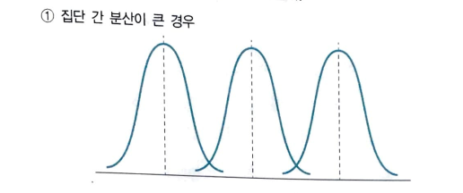
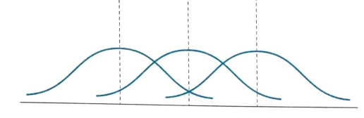
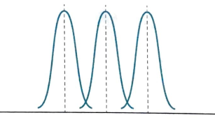
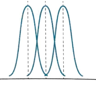

# 기본적 아이디어

집단의 분산을 기준으로 두 개 이상 집단을 비교

집단 간 분산이 크면 평균이 멀리 떨어져 있다는 의미. 즉, 분산이 크다는 말과 평균이 다르다는 말은 같은 맥락.

그러나 분산이 큰 경우에는 평균이 다르지만 공유하는 부분이 많아 집단이 다르다고 주장하기 어려움. 평균과 분산을 함께 봐야 진정 평균이 다르다는 의미를 알 수 있음.

집단 내 분산이 작은 경우, 평균의 사소한 차이가 집단이 다르다는 점을 보여줄 수도 있음.

집단 내 분산이 작으면서 집단 간 분산이 작은 경우. 여전히 겹치는 영역이 존재하게 되어 집단이 다르다고 주장하기 어려움 

## F-분포

집단 간 분산과 집단 내 분산의 비(ratio)

집단은 모두 같은 모집단에서 나왔다는 가정을 검정하려는 것임

만약 모집단이 다르면 F-값이 커지는 특성이 있음

F값은 분산의 비율로 이해됨

F값을 계산하기 위해 필요한 자유도는: 집단 간 분산(between group) 자유도와 집단 내(within group) 분산의 자유도

$$ 집단간 분산= \frac{\sum_{g}[(\bar{X_{g}}-\bar{x})^2n_{g}]}{g-1} $$

