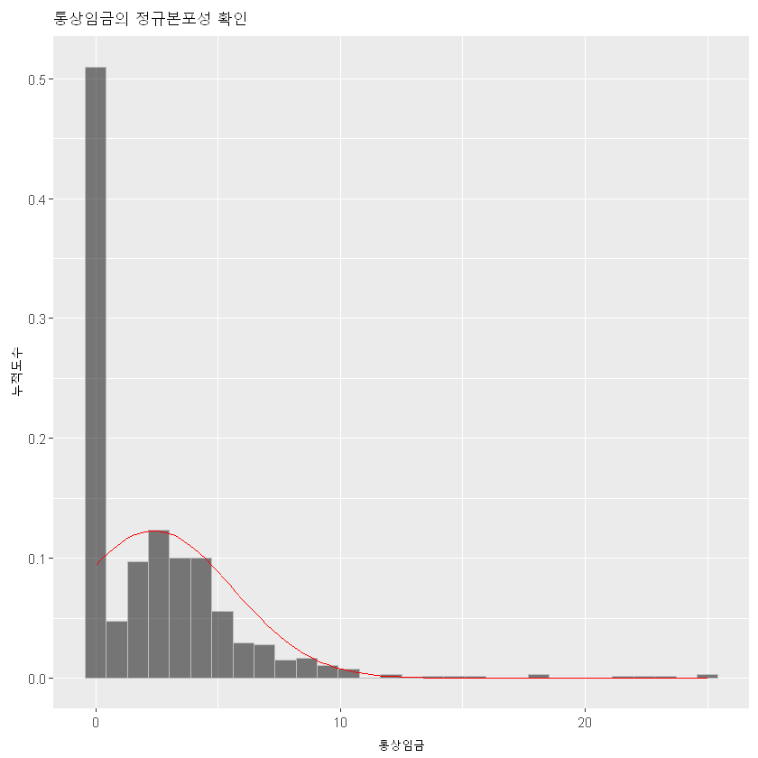

### 들어가는 말
본 자료는 우석진 교수님의 "경제 빅데이터 분석을 위한 R" (주)지필미디어. 를 참고로 하였습니다.

광운대학교 경영학부 부교수 김태경

2020년 4월 29일

# 회귀분석
## 분석 목적
* 정책변수와 성과변수 사이의 인과관계 추정

## 예제
* 노동경제학에서 자주 사용하는 Mincer의 임금 방정식을 보자.
* 로그 임금은 교육과 경력에 의해 결정된다고 생각할 때 다음과 같은 방정식을 세울 수 있다.
$$ ln(w_{i})=\beta_{0}+\beta_{1}edu_{i}+\beta_{2}exp_{i}+\epsilon_{i}$$
* 물론 교육은 edu, 경력은 exp, 그리고 첨자 i는 각 개인(individual)을 나타낸다. 엡실론은 미처 설명하지 못한 개인의 차이를 뜻한다.


```R
suppressMessages(suppressWarnings({
    library(AER) #계량경제 패키지
    library(tidyverse) #데이터처리 패키지
    library(ggplot2) #그래프 도구
    library(grid) #그래프 도구
    library(gridExtra) #그래프 도구
}))
```

함수 suppressMessage()는 메시지를 보여주지 말라는 뜻, 그리고 suppressWarnings()는 경고를 보여주지 말라는 뜻이다.


```R
data(PSID1976)
```

데이터를 불러오는 data()함수를 사용하여 AER 패키지 안에 있는 PSID1976 데이터를 가져왔다. 이 데이터를 이용해서 회귀분석을 수행해보자.


```R
str(PSID1976)
```

    'data.frame':	753 obs. of  21 variables:
     $ participation: Factor w/ 2 levels "no","yes": 2 2 2 2 2 2 2 2 2 2 ...
     $ hours        : int  1610 1656 1980 456 1568 2032 1440 1020 1458 1600 ...
     $ youngkids    : int  1 0 1 0 1 0 0 0 0 0 ...
     $ oldkids      : int  0 2 3 3 2 0 2 0 2 2 ...
     $ age          : int  32 30 35 34 31 54 37 54 48 39 ...
     $ education    : int  12 12 12 12 14 12 16 12 12 12 ...
     $ wage         : num  3.35 1.39 4.55 1.1 4.59 ...
     $ repwage      : num  2.65 2.65 4.04 3.25 3.6 4.7 5.95 9.98 0 4.15 ...
     $ hhours       : int  2708 2310 3072 1920 2000 1040 2670 4120 1995 2100 ...
     $ hage         : int  34 30 40 53 32 57 37 53 52 43 ...
     $ heducation   : int  12 9 12 10 12 11 12 8 4 12 ...
     $ hwage        : num  4.03 8.44 3.58 3.54 10 ...
     $ fincome      : int  16310 21800 21040 7300 27300 19495 21152 18900 20405 20425 ...
     $ tax          : num  0.722 0.661 0.692 0.781 0.622 ...
     $ meducation   : int  12 7 12 7 12 14 14 3 7 7 ...
     $ feducation   : int  7 7 7 7 14 7 7 3 7 7 ...
     $ unemp        : num  5 11 5 5 9.5 7.5 5 5 3 5 ...
     $ city         : Factor w/ 2 levels "no","yes": 1 2 1 1 2 2 1 1 1 1 ...
     $ experience   : int  14 5 15 6 7 33 11 35 24 21 ...
     $ college      : Factor w/ 2 levels "no","yes": 1 1 1 1 2 1 2 1 1 1 ...
     $ hcollege     : Factor w/ 2 levels "no","yes": 1 1 1 1 1 1 1 1 1 1 ...
    

데이터의 구조를 보기 위해 str() 함수를 사용했다. 데이터의 클래스는 data.frame이고 753개의 관측치(obs), 21개의 변수(variables)이 있는 것을 확인할 수 있다. 그리고 변수는 각각 participation, hours, youngkids 등이다. 변수를 나타내는 첨자는 $이다. 예를 들어 $participation이라고 하면 "변수 participation"이다. 각 변수의 데이터 특성이 Factor(요인), int(정수), num(실수) 등으로 표시되었다. 그리고 해당 데이터를 조금 보여준다. Factor w/ 2는 요인 2개라는 뜻이고 각각의 요인 수준(levels)은 "no", "yes" 등으로 표시된다. 뒤의 점수는 요인 수준에 따라 할당된 숫자다. 예를 들어 no=1, yes=2 라는 식이라서 2 2 2 라면 yes yes yes가 된다.


```R
attach(PSID1976)
```

함수 attach()는 해당 데이터의 변수들을 전부 벡터형태로 풀어서 현재의 작업 환경(global environment)에 풀어놓는다. 이를 거둬들이려면 detatch()라고 하면 된다.


```R
ls()
```


'PSID1976'


현재 작업 환경(environment)의 메모리 객체를 보려면 함수 ls()를 실행한다.


```R
head(PSID1976)
```


<table>
<thead><tr><th scope=col>participation</th><th scope=col>hours</th><th scope=col>youngkids</th><th scope=col>oldkids</th><th scope=col>age</th><th scope=col>education</th><th scope=col>wage</th><th scope=col>repwage</th><th scope=col>hhours</th><th scope=col>hage</th><th scope=col>...</th><th scope=col>hwage</th><th scope=col>fincome</th><th scope=col>tax</th><th scope=col>meducation</th><th scope=col>feducation</th><th scope=col>unemp</th><th scope=col>city</th><th scope=col>experience</th><th scope=col>college</th><th scope=col>hcollege</th></tr></thead>
<tbody>
	<tr><td>yes    </td><td>1610   </td><td>1      </td><td>0      </td><td>32     </td><td>12     </td><td>3.3540 </td><td>2.65   </td><td>2708   </td><td>34     </td><td>...    </td><td> 4.0288</td><td>16310  </td><td>0.7215 </td><td>12     </td><td> 7     </td><td> 5.0   </td><td>no     </td><td>14     </td><td>no     </td><td>no     </td></tr>
	<tr><td>yes    </td><td>1656   </td><td>0      </td><td>2      </td><td>30     </td><td>12     </td><td>1.3889 </td><td>2.65   </td><td>2310   </td><td>30     </td><td>...    </td><td> 8.4416</td><td>21800  </td><td>0.6615 </td><td> 7     </td><td> 7     </td><td>11.0   </td><td>yes    </td><td> 5     </td><td>no     </td><td>no     </td></tr>
	<tr><td>yes    </td><td>1980   </td><td>1      </td><td>3      </td><td>35     </td><td>12     </td><td>4.5455 </td><td>4.04   </td><td>3072   </td><td>40     </td><td>...    </td><td> 3.5807</td><td>21040  </td><td>0.6915 </td><td>12     </td><td> 7     </td><td> 5.0   </td><td>no     </td><td>15     </td><td>no     </td><td>no     </td></tr>
	<tr><td>yes    </td><td> 456   </td><td>0      </td><td>3      </td><td>34     </td><td>12     </td><td>1.0965 </td><td>3.25   </td><td>1920   </td><td>53     </td><td>...    </td><td> 3.5417</td><td> 7300  </td><td>0.7815 </td><td> 7     </td><td> 7     </td><td> 5.0   </td><td>no     </td><td> 6     </td><td>no     </td><td>no     </td></tr>
	<tr><td>yes    </td><td>1568   </td><td>1      </td><td>2      </td><td>31     </td><td>14     </td><td>4.5918 </td><td>3.60   </td><td>2000   </td><td>32     </td><td>...    </td><td>10.0000</td><td>27300  </td><td>0.6215 </td><td>12     </td><td>14     </td><td> 9.5   </td><td>yes    </td><td> 7     </td><td>yes    </td><td>no     </td></tr>
	<tr><td>yes    </td><td>2032   </td><td>0      </td><td>0      </td><td>54     </td><td>12     </td><td>4.7421 </td><td>4.70   </td><td>1040   </td><td>57     </td><td>...    </td><td> 6.7106</td><td>19495  </td><td>0.6915 </td><td>14     </td><td> 7     </td><td> 7.5   </td><td>yes    </td><td>33     </td><td>no     </td><td>no     </td></tr>
</tbody>
</table>


```R
tail(hours)
```


<ol class=list-inline>
	<li>0</li>
	<li>0</li>
	<li>0</li>
	<li>0</li>
	<li>0</li>
	<li>0</li>
</ol>


데이터의 일부를 살펴보기 위해 head()와 tail()을 실행했다. 각각 처음 5개, 뒤의 5개라는 말이다. 보여주는 개수를 정해줄 수도 있다.


```R
head(PSID1976, n=2)
```


<table>
<thead><tr><th scope=col>participation</th><th scope=col>hours</th><th scope=col>youngkids</th><th scope=col>oldkids</th><th scope=col>age</th><th scope=col>education</th><th scope=col>wage</th><th scope=col>repwage</th><th scope=col>hhours</th><th scope=col>hage</th><th scope=col>...</th><th scope=col>hwage</th><th scope=col>fincome</th><th scope=col>tax</th><th scope=col>meducation</th><th scope=col>feducation</th><th scope=col>unemp</th><th scope=col>city</th><th scope=col>experience</th><th scope=col>college</th><th scope=col>hcollege</th></tr></thead>
<tbody>
	<tr><td>yes   </td><td>1610  </td><td>1     </td><td>0     </td><td>32    </td><td>12    </td><td>3.3540</td><td>2.65  </td><td>2708  </td><td>34    </td><td>...   </td><td>4.0288</td><td>16310 </td><td>0.7215</td><td>12    </td><td>7     </td><td> 5    </td><td>no    </td><td>14    </td><td>no    </td><td>no    </td></tr>
	<tr><td>yes   </td><td>1656  </td><td>0     </td><td>2     </td><td>30    </td><td>12    </td><td>1.3889</td><td>2.65  </td><td>2310  </td><td>30    </td><td>...   </td><td>8.4416</td><td>21800 </td><td>0.6615</td><td> 7    </td><td>7     </td><td>11    </td><td>yes   </td><td> 5    </td><td>no    </td><td>no    </td></tr>
</tbody>
</table>


### 데이터 변환 - log 임금
PSID1976의 임금 데이터는 명목임금으로 log값으로 변환되지 않았다. 우리가 추정하려는 식의 임금은 log(임금)이기 때문에 이를 변환해서 사용해야 한다. tidyverse의 mutate()함수를 써서 logwage 변수를 추가하자.


```R
PSID1976<-PSID1976%>%mutate(logwage=log(wage))
```


```R
names(PSID1976)
```


<ol class=list-inline>
	<li>'participation'</li>
	<li>'hours'</li>
	<li>'youngkids'</li>
	<li>'oldkids'</li>
	<li>'age'</li>
	<li>'education'</li>
	<li>'wage'</li>
	<li>'repwage'</li>
	<li>'hhours'</li>
	<li>'hage'</li>
	<li>'heducation'</li>
	<li>'hwage'</li>
	<li>'fincome'</li>
	<li>'tax'</li>
	<li>'meducation'</li>
	<li>'feducation'</li>
	<li>'unemp'</li>
	<li>'city'</li>
	<li>'experience'</li>
	<li>'college'</li>
	<li>'hcollege'</li>
	<li>'logwage'</li>
</ol>


변수의 이름을 출력하는 함수 names()를 써서 확인해보니 logwage가 새로 생성되었다. 

### 무한대 처리
임금이 없으면 0인데, log(0)을 취하면 -무한대가 된다(-Inf). 이 경우에는 계산이 불가능하기 때문에 계산에서 이 부분을 제외시켜야 한다. 가장 간단한 방법은 해당 부분을 결측치(NA)로 바꾸면 된다.


```R
tail(PSID1976$logwage,n=350)
```


<ol class=list-inline>
	<li>1.12223115426674</li>
	<li>0.540170810960456</li>
	<li>1.39150575817042</li>
	<li>1.69717402673819</li>
	<li>3.2188758248682</li>
	<li>0.871167835052194</li>
	<li>1.1673295666271</li>
	<li>1.21698774140343</li>
	<li>0.575376644825437</li>
	<li>1.15161578649041</li>
	<li>0.994251273343367</li>
	<li>0.526324887212914</li>
	<li>-1.54318211665704</li>
	<li>1.91204307954374</li>
	<li>0.554287331176527</li>
	<li>0.916290731874155</li>
	<li>1.50093914427577</li>
	<li>0.944683806375373</li>
	<li>1.24126858906963</li>
	<li>1.5649843316798</li>
	<li>0.83802644187803</li>
	<li>1.66885710212672</li>
	<li>1.76942864874304</li>
	<li>1.22644832684111</li>
	<li>1.40648906840541</li>
	<li>-Inf</li>
	<li>-Inf</li>
	<li>-Inf</li>
	<li>-Inf</li>
	<li>-Inf</li>
	<li>-Inf</li>
	<li>-Inf</li>
	<li>-Inf</li>
	<li>-Inf</li>
	<li>-Inf</li>
	<li>-Inf</li>
	<li>-Inf</li>
	<li>-Inf</li>
	<li>-Inf</li>
	<li>-Inf</li>
	<li>-Inf</li>
	<li>-Inf</li>
	<li>-Inf</li>
	<li>-Inf</li>
	<li>-Inf</li>
	<li>-Inf</li>
	<li>-Inf</li>
	<li>-Inf</li>
	<li>-Inf</li>
	<li>-Inf</li>
	<li>-Inf</li>
	<li>-Inf</li>
	<li>-Inf</li>
	<li>-Inf</li>
	<li>-Inf</li>
	<li>-Inf</li>
	<li>-Inf</li>
	<li>-Inf</li>
	<li>-Inf</li>
	<li>-Inf</li>
	<li>-Inf</li>
	<li>-Inf</li>
	<li>-Inf</li>
	<li>-Inf</li>
	<li>-Inf</li>
	<li>-Inf</li>
	<li>-Inf</li>
	<li>-Inf</li>
	<li>-Inf</li>
	<li>-Inf</li>
	<li>-Inf</li>
	<li>-Inf</li>
	<li>-Inf</li>
	<li>-Inf</li>
	<li>-Inf</li>
	<li>-Inf</li>
	<li>-Inf</li>
	<li>-Inf</li>
	<li>-Inf</li>
	<li>-Inf</li>
	<li>-Inf</li>
	<li>-Inf</li>
	<li>-Inf</li>
	<li>-Inf</li>
	<li>-Inf</li>
	<li>-Inf</li>
	<li>-Inf</li>
	<li>-Inf</li>
	<li>-Inf</li>
	<li>-Inf</li>
	<li>-Inf</li>
	<li>-Inf</li>
	<li>-Inf</li>
	<li>-Inf</li>
	<li>-Inf</li>
	<li>-Inf</li>
	<li>-Inf</li>
	<li>-Inf</li>
	<li>-Inf</li>
	<li>-Inf</li>
	<li>-Inf</li>
	<li>-Inf</li>
	<li>-Inf</li>
	<li>-Inf</li>
	<li>-Inf</li>
	<li>-Inf</li>
	<li>-Inf</li>
	<li>-Inf</li>
	<li>-Inf</li>
	<li>-Inf</li>
	<li>-Inf</li>
	<li>-Inf</li>
	<li>-Inf</li>
	<li>-Inf</li>
	<li>-Inf</li>
	<li>-Inf</li>
	<li>-Inf</li>
	<li>-Inf</li>
	<li>-Inf</li>
	<li>-Inf</li>
	<li>-Inf</li>
	<li>-Inf</li>
	<li>-Inf</li>
	<li>-Inf</li>
	<li>-Inf</li>
	<li>-Inf</li>
	<li>-Inf</li>
	<li>-Inf</li>
	<li>-Inf</li>
	<li>-Inf</li>
	<li>-Inf</li>
	<li>-Inf</li>
	<li>-Inf</li>
	<li>-Inf</li>
	<li>-Inf</li>
	<li>-Inf</li>
	<li>-Inf</li>
	<li>-Inf</li>
	<li>-Inf</li>
	<li>-Inf</li>
	<li>-Inf</li>
	<li>-Inf</li>
	<li>-Inf</li>
	<li>-Inf</li>
	<li>-Inf</li>
	<li>-Inf</li>
	<li>-Inf</li>
	<li>-Inf</li>
	<li>-Inf</li>
	<li>-Inf</li>
	<li>-Inf</li>
	<li>-Inf</li>
	<li>-Inf</li>
	<li>-Inf</li>
	<li>-Inf</li>
	<li>-Inf</li>
	<li>-Inf</li>
	<li>-Inf</li>
	<li>-Inf</li>
	<li>-Inf</li>
	<li>-Inf</li>
	<li>-Inf</li>
	<li>-Inf</li>
	<li>-Inf</li>
	<li>-Inf</li>
	<li>-Inf</li>
	<li>-Inf</li>
	<li>-Inf</li>
	<li>-Inf</li>
	<li>-Inf</li>
	<li>-Inf</li>
	<li>-Inf</li>
	<li>-Inf</li>
	<li>-Inf</li>
	<li>-Inf</li>
	<li>-Inf</li>
	<li>-Inf</li>
	<li>-Inf</li>
	<li>-Inf</li>
	<li>-Inf</li>
	<li>-Inf</li>
	<li>-Inf</li>
	<li>-Inf</li>
	<li>-Inf</li>
	<li>-Inf</li>
	<li>-Inf</li>
	<li>-Inf</li>
	<li>-Inf</li>
	<li>-Inf</li>
	<li>-Inf</li>
	<li>-Inf</li>
	<li>-Inf</li>
	<li>-Inf</li>
	<li>-Inf</li>
	<li>-Inf</li>
	<li>-Inf</li>
	<li>-Inf</li>
	<li>-Inf</li>
	<li>-Inf</li>
	<li>-Inf</li>
	<li>-Inf</li>
	<li>-Inf</li>
	<li>-Inf</li>
	<li>-Inf</li>
	<li>-Inf</li>
	<li>-Inf</li>
	<li>-Inf</li>
	<li>-Inf</li>
	<li>-Inf</li>
	<li>-Inf</li>
	<li>-Inf</li>
	<li>-Inf</li>
	<li>-Inf</li>
	<li>-Inf</li>
	<li>-Inf</li>
	<li>-Inf</li>
	<li>-Inf</li>
	<li>-Inf</li>
	<li>-Inf</li>
	<li>-Inf</li>
	<li>-Inf</li>
	<li>-Inf</li>
	<li>-Inf</li>
	<li>-Inf</li>
	<li>-Inf</li>
	<li>-Inf</li>
	<li>-Inf</li>
	<li>-Inf</li>
	<li>-Inf</li>
	<li>-Inf</li>
	<li>-Inf</li>
	<li>-Inf</li>
	<li>-Inf</li>
	<li>-Inf</li>
	<li>-Inf</li>
	<li>-Inf</li>
	<li>-Inf</li>
	<li>-Inf</li>
	<li>-Inf</li>
	<li>-Inf</li>
	<li>-Inf</li>
	<li>-Inf</li>
	<li>-Inf</li>
	<li>-Inf</li>
	<li>-Inf</li>
	<li>-Inf</li>
	<li>-Inf</li>
	<li>-Inf</li>
	<li>-Inf</li>
	<li>-Inf</li>
	<li>-Inf</li>
	<li>-Inf</li>
	<li>-Inf</li>
	<li>-Inf</li>
	<li>-Inf</li>
	<li>-Inf</li>
	<li>-Inf</li>
	<li>-Inf</li>
	<li>-Inf</li>
	<li>-Inf</li>
	<li>-Inf</li>
	<li>-Inf</li>
	<li>-Inf</li>
	<li>-Inf</li>
	<li>-Inf</li>
	<li>-Inf</li>
	<li>-Inf</li>
	<li>-Inf</li>
	<li>-Inf</li>
	<li>-Inf</li>
	<li>-Inf</li>
	<li>-Inf</li>
	<li>-Inf</li>
	<li>-Inf</li>
	<li>-Inf</li>
	<li>-Inf</li>
	<li>-Inf</li>
	<li>-Inf</li>
	<li>-Inf</li>
	<li>-Inf</li>
	<li>-Inf</li>
	<li>-Inf</li>
	<li>-Inf</li>
	<li>-Inf</li>
	<li>-Inf</li>
	<li>-Inf</li>
	<li>-Inf</li>
	<li>-Inf</li>
	<li>-Inf</li>
	<li>-Inf</li>
	<li>-Inf</li>
	<li>-Inf</li>
	<li>-Inf</li>
	<li>-Inf</li>
	<li>-Inf</li>
	<li>-Inf</li>
	<li>-Inf</li>
	<li>-Inf</li>
	<li>-Inf</li>
	<li>-Inf</li>
	<li>-Inf</li>
	<li>-Inf</li>
	<li>-Inf</li>
	<li>-Inf</li>
	<li>-Inf</li>
	<li>-Inf</li>
	<li>-Inf</li>
	<li>-Inf</li>
	<li>-Inf</li>
	<li>-Inf</li>
	<li>-Inf</li>
	<li>-Inf</li>
	<li>-Inf</li>
	<li>-Inf</li>
	<li>-Inf</li>
	<li>-Inf</li>
	<li>-Inf</li>
	<li>-Inf</li>
	<li>-Inf</li>
	<li>-Inf</li>
	<li>-Inf</li>
	<li>-Inf</li>
	<li>-Inf</li>
	<li>-Inf</li>
	<li>-Inf</li>
	<li>-Inf</li>
	<li>-Inf</li>
	<li>-Inf</li>
	<li>-Inf</li>
	<li>-Inf</li>
	<li>-Inf</li>
	<li>-Inf</li>
	<li>-Inf</li>
	<li>-Inf</li>
	<li>-Inf</li>
	<li>-Inf</li>
	<li>-Inf</li>
	<li>-Inf</li>
	<li>-Inf</li>
	<li>-Inf</li>
	<li>-Inf</li>
	<li>-Inf</li>
	<li>-Inf</li>
	<li>-Inf</li>
	<li>-Inf</li>
	<li>-Inf</li>
	<li>-Inf</li>
	<li>-Inf</li>
	<li>-Inf</li>
	<li>-Inf</li>
</ol>


잠깐, 결측치를 확인하는 함수는 is.na()이고 여기에 결측치면 TRUE, 그렇지 않으면 FALSE를 할당한다.


```R
is.na(c(NA,1,2,NA,3,4))
```


<ol class=list-inline>
	<li>TRUE</li>
	<li>FALSE</li>
	<li>FALSE</li>
	<li>TRUE</li>
	<li>FALSE</li>
	<li>FALSE</li>
</ol>


벡터를 결측치로 처리하면 TRUE나 FALSE로 값을 할당하면 된다.


```R
test<-c(NA,1,2,NA,3,4)
test
is.na(test)<-TRUE
test
rm(test)
```


<ol class=list-inline>
	<li>&lt;NA&gt;</li>
	<li>1</li>
	<li>2</li>
	<li>&lt;NA&gt;</li>
	<li>3</li>
	<li>4</li>
</ol>


<ol class=list-inline>
	<li>&lt;NA&gt;</li>
	<li>&lt;NA&gt;</li>
	<li>&lt;NA&gt;</li>
	<li>&lt;NA&gt;</li>
	<li>&lt;NA&gt;</li>
	<li>&lt;NA&gt;</li>
</ol>


벡터 test는 잠시 썼던 것이라서 메모리에서 깔끔하게 지웠다. 이때 rm() 함수를 썼다. Remove라는 뜻이다.

무한대를 확인하는 함수는 is.infinite()이다. 함수를 개별 벡터에 적용하여 스칼라 값을 구하는 손쉬운 방법은 간단적용함수(simple apply = sapply())를 사용하는 것이다. 방법은 sapply(데이터,함수이름)이다. 아래의 코드를 살펴보자.


```R
is.na(PSID1976)<-sapply(PSID1976,is.infinite)
```


```R
tail(PSID1976$logwage,n=350)
```


<ol class=list-inline>
	<li>1.12223115426674</li>
	<li>0.540170810960456</li>
	<li>1.39150575817042</li>
	<li>1.69717402673819</li>
	<li>3.2188758248682</li>
	<li>0.871167835052194</li>
	<li>1.1673295666271</li>
	<li>1.21698774140343</li>
	<li>0.575376644825437</li>
	<li>1.15161578649041</li>
	<li>0.994251273343367</li>
	<li>0.526324887212914</li>
	<li>-1.54318211665704</li>
	<li>1.91204307954374</li>
	<li>0.554287331176527</li>
	<li>0.916290731874155</li>
	<li>1.50093914427577</li>
	<li>0.944683806375373</li>
	<li>1.24126858906963</li>
	<li>1.5649843316798</li>
	<li>0.83802644187803</li>
	<li>1.66885710212672</li>
	<li>1.76942864874304</li>
	<li>1.22644832684111</li>
	<li>1.40648906840541</li>
	<li>&lt;NA&gt;</li>
	<li>&lt;NA&gt;</li>
	<li>&lt;NA&gt;</li>
	<li>&lt;NA&gt;</li>
	<li>&lt;NA&gt;</li>
	<li>&lt;NA&gt;</li>
	<li>&lt;NA&gt;</li>
	<li>&lt;NA&gt;</li>
	<li>&lt;NA&gt;</li>
	<li>&lt;NA&gt;</li>
	<li>&lt;NA&gt;</li>
	<li>&lt;NA&gt;</li>
	<li>&lt;NA&gt;</li>
	<li>&lt;NA&gt;</li>
	<li>&lt;NA&gt;</li>
	<li>&lt;NA&gt;</li>
	<li>&lt;NA&gt;</li>
	<li>&lt;NA&gt;</li>
	<li>&lt;NA&gt;</li>
	<li>&lt;NA&gt;</li>
	<li>&lt;NA&gt;</li>
	<li>&lt;NA&gt;</li>
	<li>&lt;NA&gt;</li>
	<li>&lt;NA&gt;</li>
	<li>&lt;NA&gt;</li>
	<li>&lt;NA&gt;</li>
	<li>&lt;NA&gt;</li>
	<li>&lt;NA&gt;</li>
	<li>&lt;NA&gt;</li>
	<li>&lt;NA&gt;</li>
	<li>&lt;NA&gt;</li>
	<li>&lt;NA&gt;</li>
	<li>&lt;NA&gt;</li>
	<li>&lt;NA&gt;</li>
	<li>&lt;NA&gt;</li>
	<li>&lt;NA&gt;</li>
	<li>&lt;NA&gt;</li>
	<li>&lt;NA&gt;</li>
	<li>&lt;NA&gt;</li>
	<li>&lt;NA&gt;</li>
	<li>&lt;NA&gt;</li>
	<li>&lt;NA&gt;</li>
	<li>&lt;NA&gt;</li>
	<li>&lt;NA&gt;</li>
	<li>&lt;NA&gt;</li>
	<li>&lt;NA&gt;</li>
	<li>&lt;NA&gt;</li>
	<li>&lt;NA&gt;</li>
	<li>&lt;NA&gt;</li>
	<li>&lt;NA&gt;</li>
	<li>&lt;NA&gt;</li>
	<li>&lt;NA&gt;</li>
	<li>&lt;NA&gt;</li>
	<li>&lt;NA&gt;</li>
	<li>&lt;NA&gt;</li>
	<li>&lt;NA&gt;</li>
	<li>&lt;NA&gt;</li>
	<li>&lt;NA&gt;</li>
	<li>&lt;NA&gt;</li>
	<li>&lt;NA&gt;</li>
	<li>&lt;NA&gt;</li>
	<li>&lt;NA&gt;</li>
	<li>&lt;NA&gt;</li>
	<li>&lt;NA&gt;</li>
	<li>&lt;NA&gt;</li>
	<li>&lt;NA&gt;</li>
	<li>&lt;NA&gt;</li>
	<li>&lt;NA&gt;</li>
	<li>&lt;NA&gt;</li>
	<li>&lt;NA&gt;</li>
	<li>&lt;NA&gt;</li>
	<li>&lt;NA&gt;</li>
	<li>&lt;NA&gt;</li>
	<li>&lt;NA&gt;</li>
	<li>&lt;NA&gt;</li>
	<li>&lt;NA&gt;</li>
	<li>&lt;NA&gt;</li>
	<li>&lt;NA&gt;</li>
	<li>&lt;NA&gt;</li>
	<li>&lt;NA&gt;</li>
	<li>&lt;NA&gt;</li>
	<li>&lt;NA&gt;</li>
	<li>&lt;NA&gt;</li>
	<li>&lt;NA&gt;</li>
	<li>&lt;NA&gt;</li>
	<li>&lt;NA&gt;</li>
	<li>&lt;NA&gt;</li>
	<li>&lt;NA&gt;</li>
	<li>&lt;NA&gt;</li>
	<li>&lt;NA&gt;</li>
	<li>&lt;NA&gt;</li>
	<li>&lt;NA&gt;</li>
	<li>&lt;NA&gt;</li>
	<li>&lt;NA&gt;</li>
	<li>&lt;NA&gt;</li>
	<li>&lt;NA&gt;</li>
	<li>&lt;NA&gt;</li>
	<li>&lt;NA&gt;</li>
	<li>&lt;NA&gt;</li>
	<li>&lt;NA&gt;</li>
	<li>&lt;NA&gt;</li>
	<li>&lt;NA&gt;</li>
	<li>&lt;NA&gt;</li>
	<li>&lt;NA&gt;</li>
	<li>&lt;NA&gt;</li>
	<li>&lt;NA&gt;</li>
	<li>&lt;NA&gt;</li>
	<li>&lt;NA&gt;</li>
	<li>&lt;NA&gt;</li>
	<li>&lt;NA&gt;</li>
	<li>&lt;NA&gt;</li>
	<li>&lt;NA&gt;</li>
	<li>&lt;NA&gt;</li>
	<li>&lt;NA&gt;</li>
	<li>&lt;NA&gt;</li>
	<li>&lt;NA&gt;</li>
	<li>&lt;NA&gt;</li>
	<li>&lt;NA&gt;</li>
	<li>&lt;NA&gt;</li>
	<li>&lt;NA&gt;</li>
	<li>&lt;NA&gt;</li>
	<li>&lt;NA&gt;</li>
	<li>&lt;NA&gt;</li>
	<li>&lt;NA&gt;</li>
	<li>&lt;NA&gt;</li>
	<li>&lt;NA&gt;</li>
	<li>&lt;NA&gt;</li>
	<li>&lt;NA&gt;</li>
	<li>&lt;NA&gt;</li>
	<li>&lt;NA&gt;</li>
	<li>&lt;NA&gt;</li>
	<li>&lt;NA&gt;</li>
	<li>&lt;NA&gt;</li>
	<li>&lt;NA&gt;</li>
	<li>&lt;NA&gt;</li>
	<li>&lt;NA&gt;</li>
	<li>&lt;NA&gt;</li>
	<li>&lt;NA&gt;</li>
	<li>&lt;NA&gt;</li>
	<li>&lt;NA&gt;</li>
	<li>&lt;NA&gt;</li>
	<li>&lt;NA&gt;</li>
	<li>&lt;NA&gt;</li>
	<li>&lt;NA&gt;</li>
	<li>&lt;NA&gt;</li>
	<li>&lt;NA&gt;</li>
	<li>&lt;NA&gt;</li>
	<li>&lt;NA&gt;</li>
	<li>&lt;NA&gt;</li>
	<li>&lt;NA&gt;</li>
	<li>&lt;NA&gt;</li>
	<li>&lt;NA&gt;</li>
	<li>&lt;NA&gt;</li>
	<li>&lt;NA&gt;</li>
	<li>&lt;NA&gt;</li>
	<li>&lt;NA&gt;</li>
	<li>&lt;NA&gt;</li>
	<li>&lt;NA&gt;</li>
	<li>&lt;NA&gt;</li>
	<li>&lt;NA&gt;</li>
	<li>&lt;NA&gt;</li>
	<li>&lt;NA&gt;</li>
	<li>&lt;NA&gt;</li>
	<li>&lt;NA&gt;</li>
	<li>&lt;NA&gt;</li>
	<li>&lt;NA&gt;</li>
	<li>&lt;NA&gt;</li>
	<li>&lt;NA&gt;</li>
	<li>&lt;NA&gt;</li>
	<li>&lt;NA&gt;</li>
	<li>&lt;NA&gt;</li>
	<li>&lt;NA&gt;</li>
	<li>&lt;NA&gt;</li>
	<li>&lt;NA&gt;</li>
	<li>&lt;NA&gt;</li>
	<li>&lt;NA&gt;</li>
	<li>&lt;NA&gt;</li>
	<li>&lt;NA&gt;</li>
	<li>&lt;NA&gt;</li>
	<li>&lt;NA&gt;</li>
	<li>&lt;NA&gt;</li>
	<li>&lt;NA&gt;</li>
	<li>&lt;NA&gt;</li>
	<li>&lt;NA&gt;</li>
	<li>&lt;NA&gt;</li>
	<li>&lt;NA&gt;</li>
	<li>&lt;NA&gt;</li>
	<li>&lt;NA&gt;</li>
	<li>&lt;NA&gt;</li>
	<li>&lt;NA&gt;</li>
	<li>&lt;NA&gt;</li>
	<li>&lt;NA&gt;</li>
	<li>&lt;NA&gt;</li>
	<li>&lt;NA&gt;</li>
	<li>&lt;NA&gt;</li>
	<li>&lt;NA&gt;</li>
	<li>&lt;NA&gt;</li>
	<li>&lt;NA&gt;</li>
	<li>&lt;NA&gt;</li>
	<li>&lt;NA&gt;</li>
	<li>&lt;NA&gt;</li>
	<li>&lt;NA&gt;</li>
	<li>&lt;NA&gt;</li>
	<li>&lt;NA&gt;</li>
	<li>&lt;NA&gt;</li>
	<li>&lt;NA&gt;</li>
	<li>&lt;NA&gt;</li>
	<li>&lt;NA&gt;</li>
	<li>&lt;NA&gt;</li>
	<li>&lt;NA&gt;</li>
	<li>&lt;NA&gt;</li>
	<li>&lt;NA&gt;</li>
	<li>&lt;NA&gt;</li>
	<li>&lt;NA&gt;</li>
	<li>&lt;NA&gt;</li>
	<li>&lt;NA&gt;</li>
	<li>&lt;NA&gt;</li>
	<li>&lt;NA&gt;</li>
	<li>&lt;NA&gt;</li>
	<li>&lt;NA&gt;</li>
	<li>&lt;NA&gt;</li>
	<li>&lt;NA&gt;</li>
	<li>&lt;NA&gt;</li>
	<li>&lt;NA&gt;</li>
	<li>&lt;NA&gt;</li>
	<li>&lt;NA&gt;</li>
	<li>&lt;NA&gt;</li>
	<li>&lt;NA&gt;</li>
	<li>&lt;NA&gt;</li>
	<li>&lt;NA&gt;</li>
	<li>&lt;NA&gt;</li>
	<li>&lt;NA&gt;</li>
	<li>&lt;NA&gt;</li>
	<li>&lt;NA&gt;</li>
	<li>&lt;NA&gt;</li>
	<li>&lt;NA&gt;</li>
	<li>&lt;NA&gt;</li>
	<li>&lt;NA&gt;</li>
	<li>&lt;NA&gt;</li>
	<li>&lt;NA&gt;</li>
	<li>&lt;NA&gt;</li>
	<li>&lt;NA&gt;</li>
	<li>&lt;NA&gt;</li>
	<li>&lt;NA&gt;</li>
	<li>&lt;NA&gt;</li>
	<li>&lt;NA&gt;</li>
	<li>&lt;NA&gt;</li>
	<li>&lt;NA&gt;</li>
	<li>&lt;NA&gt;</li>
	<li>&lt;NA&gt;</li>
	<li>&lt;NA&gt;</li>
	<li>&lt;NA&gt;</li>
	<li>&lt;NA&gt;</li>
	<li>&lt;NA&gt;</li>
	<li>&lt;NA&gt;</li>
	<li>&lt;NA&gt;</li>
	<li>&lt;NA&gt;</li>
	<li>&lt;NA&gt;</li>
	<li>&lt;NA&gt;</li>
	<li>&lt;NA&gt;</li>
	<li>&lt;NA&gt;</li>
	<li>&lt;NA&gt;</li>
	<li>&lt;NA&gt;</li>
	<li>&lt;NA&gt;</li>
	<li>&lt;NA&gt;</li>
	<li>&lt;NA&gt;</li>
	<li>&lt;NA&gt;</li>
	<li>&lt;NA&gt;</li>
	<li>&lt;NA&gt;</li>
	<li>&lt;NA&gt;</li>
	<li>&lt;NA&gt;</li>
	<li>&lt;NA&gt;</li>
	<li>&lt;NA&gt;</li>
	<li>&lt;NA&gt;</li>
	<li>&lt;NA&gt;</li>
	<li>&lt;NA&gt;</li>
	<li>&lt;NA&gt;</li>
	<li>&lt;NA&gt;</li>
	<li>&lt;NA&gt;</li>
	<li>&lt;NA&gt;</li>
	<li>&lt;NA&gt;</li>
	<li>&lt;NA&gt;</li>
	<li>&lt;NA&gt;</li>
	<li>&lt;NA&gt;</li>
	<li>&lt;NA&gt;</li>
	<li>&lt;NA&gt;</li>
	<li>&lt;NA&gt;</li>
	<li>&lt;NA&gt;</li>
	<li>&lt;NA&gt;</li>
	<li>&lt;NA&gt;</li>
	<li>&lt;NA&gt;</li>
	<li>&lt;NA&gt;</li>
	<li>&lt;NA&gt;</li>
	<li>&lt;NA&gt;</li>
	<li>&lt;NA&gt;</li>
	<li>&lt;NA&gt;</li>
	<li>&lt;NA&gt;</li>
	<li>&lt;NA&gt;</li>
	<li>&lt;NA&gt;</li>
	<li>&lt;NA&gt;</li>
	<li>&lt;NA&gt;</li>
	<li>&lt;NA&gt;</li>
	<li>&lt;NA&gt;</li>
	<li>&lt;NA&gt;</li>
	<li>&lt;NA&gt;</li>
	<li>&lt;NA&gt;</li>
	<li>&lt;NA&gt;</li>
	<li>&lt;NA&gt;</li>
	<li>&lt;NA&gt;</li>
	<li>&lt;NA&gt;</li>
	<li>&lt;NA&gt;</li>
	<li>&lt;NA&gt;</li>
	<li>&lt;NA&gt;</li>
	<li>&lt;NA&gt;</li>
	<li>&lt;NA&gt;</li>
	<li>&lt;NA&gt;</li>
	<li>&lt;NA&gt;</li>
	<li>&lt;NA&gt;</li>
	<li>&lt;NA&gt;</li>
	<li>&lt;NA&gt;</li>
	<li>&lt;NA&gt;</li>
	<li>&lt;NA&gt;</li>
	<li>&lt;NA&gt;</li>
	<li>&lt;NA&gt;</li>
	<li>&lt;NA&gt;</li>
</ol>


무한대가 모두 결측값(NA)로 바뀌었다.

### 로그 임금의 효과
회귀분석에서 Y쪽 변수는 가능한 정규분포를 따라줘야 한다. 특히 데이터의 수가 적다면(1000개 정도도 작은 것) 종모양의 대칭분포에 가까운가를 눈으로 확인하면 좋다. 그래프를 그려서 확인해보자.

우리는 ggplot() 그래프 도구를 사용할 예정이다. 팔레트를 놓기 위해 ggplot(데이터,aes()) 형태로 사용한다. aes()는 그래프의 데이터 요소를 반영하는 함수다. 분포를 볼 때 적당한 것이 히스토그램이다. 히스토그램 위젯은 geom_histogram()이다. 이 위젯을 팔레트 위에 더해주는(+) 과정을 거쳐서 그래프를 그려보기로 한다. 히스토그램으로 데이터를 처리하기 위해 geom_histogram()의 데이터 요소(aes)에 밀도함수 계산을 추가하자. 함수를 추가하기 위해 ..density..라는 코드를 사용했다. 

이외에 투명도(alpha), 채움(fill), 그리고 색상(col)을 두었다. aes 안에 있지 않고 밖에 있다는 점을 눈여겨 보자. 위젯 자체의 속성이고 데이터와는 무관하기 때문이다.

히스토그램을 따라서 정규분포 선을 그어서 비교해보자. 정규분포를 계산하는 확률밀도함수는 dnorm()이다. Density of Normal distribution의 약자다. 색상(color)는 red로 하고 dnorm에 필요한 평균(mean)과 표준편차(sd)를 넘겨주기 위해 args에 리스트(list)를 제출한다.

이외에 labs() 함수를 사용하여 그래프의 x, y 축 이름과 타이틀을 정해주자.

mean()은 평균을 구하는 함수, sd()는 표준편차를 구하는 함수다. na.rm=TRUE라고 하면 결측값을 제외하라는(NA should be removed) 뜻이다.

출력은 print(그래프)로 한다. 이때 귀찮은 메시지를 보기 싫으니 suppressWarnings(suppressMessages())안에 넣어주자.


```R
fig1<-ggplot(PSID1976,aes(x=wage))+
    geom_histogram(aes(y=..density..),alpha=0.5,fill='black',col='grey')+
    stat_function(fun=dnorm,color='red',args=list(mean=mean(wage,na.rm=TRUE),sd=sd(wage,na.rm=TRUE)))+
    labs(title="통상임금의 정규본포성 확인",x='통상임금',y='누적도수')
suppressWarnings(suppressMessages(print(fig1)))
```





```R

```
